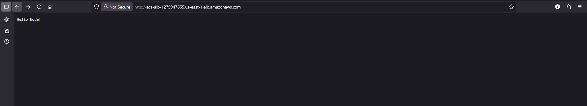
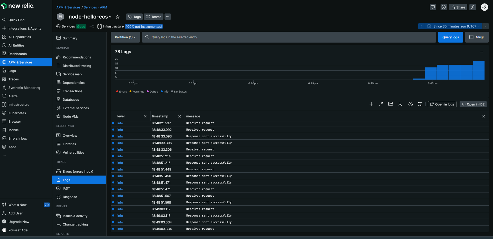
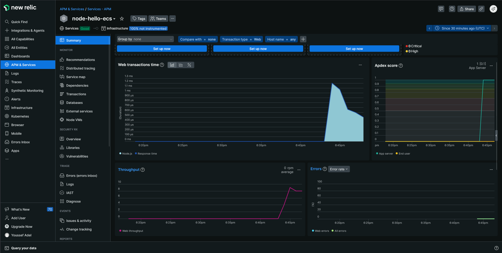
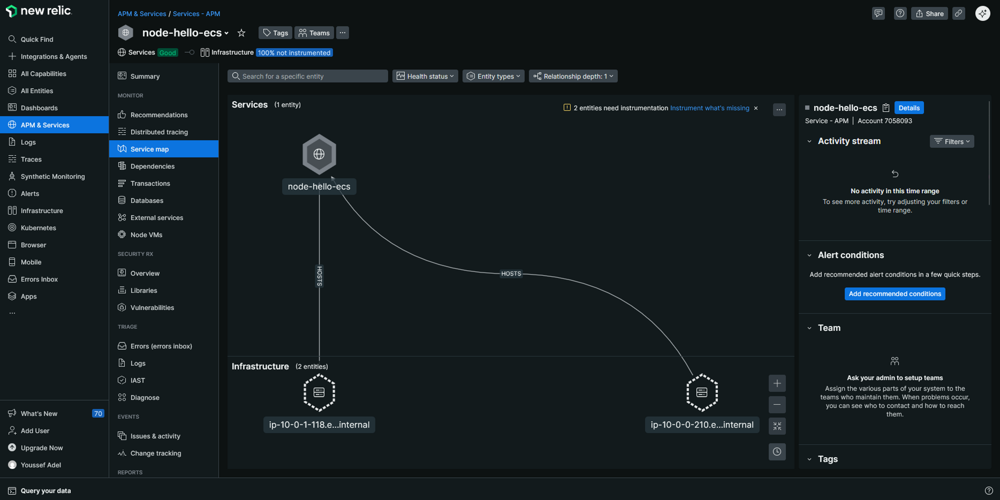

# Node.js Hello World with New Relic & AWS ECS

Simple Node.js app with automated deployment & log aggregation.

### Prerequisites

- Node.js, Docker, AWS Account, New Relic Account, Terraform

### AWS Setup (Required First)

#### 1. Create S3 Bucket for Terraform Backend

- Create bucket with a globally unique name.
- Block public access, enable versioning.
- Update iac/backend.tf with your bucket name:
  bucket = "your-terraform-state-bucket-name"

#### 2. Create GitHub OIDC Provider

- Create an OIDC for Github:

```
Provider URL: https://token.actions.githubusercontent.com
Audience: sts.amazonaws.com
```

#### 3. Create IAM Web Identity Role with Minimum Required Permissions

Create role `github-actions-role` with policies:

- `AmazonECSFullAccess`
- `AmazonEC2FullAccess`
- `AmazonVPCFullAccess`
- `IAMFullAccess`
- `AmazonS3FullAccess`
- `ElasticLoadBalancingFullAccess`

### Steps Required for the CI pipeline to work

1- Fork repo then clone it locally

```bash
git clone <repo url>
cd node-hello
```

2- Dockerize app & push to DockerHub

```bash
docker build -t your-dockerhub-username/node-hello:v1 .

docker push your-dockerhub-username/node-hello:v1

# Test locally (optional)
$env:NEW_RELIC_LICENSE_KEY="your new relic license key"
docker run -dit -P your-dockerhub-username/node-hello:v1
docker ps
# App should be exposed to a random port on your host
```

### CI/CD Setup

Add GitHub Secrets:

- `AWS_ROLE_TO_ASSUME` (arn:aws:iam::YOUR_ACCOUNT_ID:role/github-actions-role)
- `DOCKER_USERNAME`
- `DOCKER_PASSWORD`
- `DOCKERHUB_REPO` (your DockerHub repo url)
- `NEW_RELIC_LICENSE_KEY` (Go to next section and follow the steps to create one)

Push to any branch triggers deployment.
Pull requests to main branch triggers deployment.

#### NOTE - In case Prettier linting stage fails, run the below locally to fix issues and push again:

```bash
npx prettier --write .
```

## Monitoring

- **New Relic**: APM and logs at newrelic.com

### Setting up new relic integration for NodeJS

- Intgrations & Agents -> Node.js -> On a host -> Create a new key -> Copy NEW_RELIC_LICENSE_KEY -> Continue -> Enter app name (node-hello-ecs) -> Continue -> Test

## Assumptions

- I'm the only one working on this terraform code so I didn't enable S3 Object locking for tfstate bucket.
- Using ECS Fargate is allowed.
- Only required to set up a log aggregation on the application level, thus I didn't add a monitoring layer for the underlying host OS.
- I'm allowed to add in the Application code without disrupting its core functionality.

## Snippets








